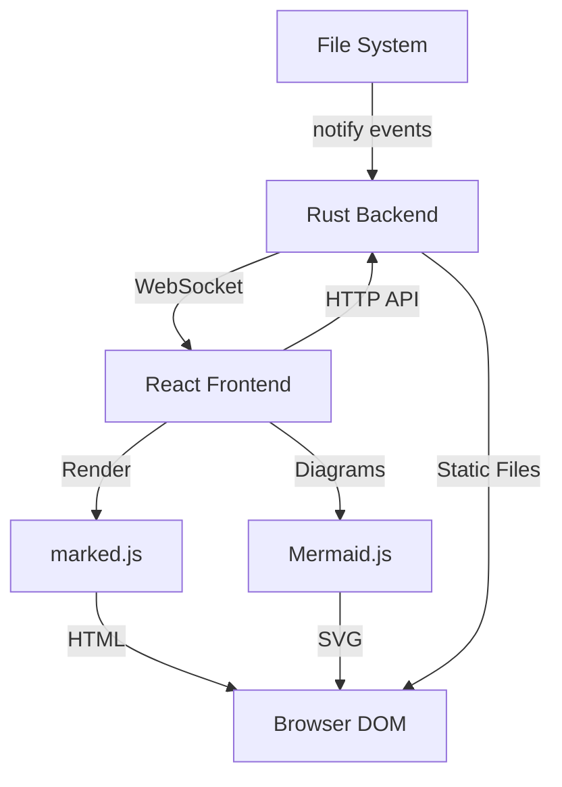
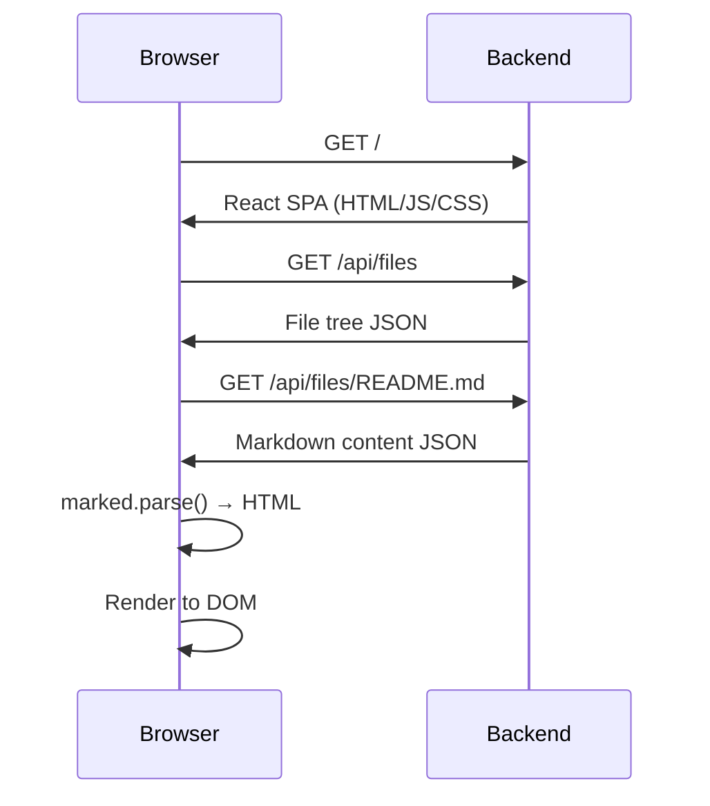
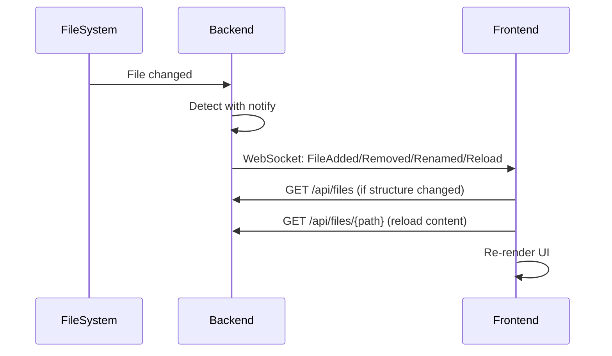

# docserve Architecture

> **Note**: This project is based on [mdserve](https://github.com/some-natalie/mdserve) but has evolved significantly with a complete React frontend rewrite and recursive folder support.

## Overview

docserve is a modern markdown documentation server with live reload, featuring a React-based single-page application for the frontend and a Rust backend for file serving and WebSocket communication.

**Core Architecture**: React SPA + Rust API Server + WebSocket Live Reload



## Architecture Components

### Backend (Rust)

**Purpose**: Lightweight HTTP/WebSocket server with file watching

**Responsibilities**:
- Serve embedded React SPA (`frontend/dist`)
- Provide REST API for file listing and content
- Watch file system for changes (recursive)
- Broadcast file change events via WebSocket
- Serve static assets (images, etc.)

**Technology Stack**:
- `axum` - HTTP server framework
- `notify` - File system watching (recursive mode)
- `tokio` - Async runtime
- `serde` - JSON serialization
- `rust-embed` - Embed frontend assets at compile time

### Frontend (React SPA)

**Purpose**: Rich interactive UI for browsing and viewing markdown

**Responsibilities**:
- Render file tree with collapsible folders
- Parse markdown to HTML client-side
- Handle relative markdown links
- Theme management and persistence
- Sidebar resize and collapse
- Real-time reload on file changes

**Technology Stack**:
- React 18 with TypeScript
- `marked` - Markdown parsing
- `mermaid` - Diagram rendering
- Vite - Build tool
- Vitest - Unit testing
- Playwright - E2E testing

## Data Flow

### Initial Load


### Live Reload


## Key Features

### Recursive Folder Support

Unlike the original mdserve (flat directories only), docserve watches directories recursively:

```rust
notify::Config::default()
    .with_poll_interval(Duration::from_millis(100))
// Watches all subdirectories automatically
```

File tree structure:
```json
{
  "files": [
    {"name": "README.md", "path": "README.md", "is_directory": false},
    {"name": "docs", "path": "docs", "is_directory": true},
    {"name": "api.md", "path": "docs/api.md", "is_directory": false}
  ]
}
```

### Client-Side Rendering

Markdown is parsed in the browser using marked.js:
- No server-side HTML generation
- Faster backend (just serves raw markdown)
- Enables client-side features (theme without reload, etc.)
- Smaller binary size

### Relative Link Navigation

Markdown links like `[API Docs](../api/overview.md)` are intercepted and resolved client-side:

```typescript
// frontend/src/components/MarkdownContent.tsx
const resolvedPath = resolvePath(currentFilePath, linkHref)
onLinkClick(resolvedPath) // Navigate without full page reload
```

### WebSocket Messages

Backend → Frontend messages:

```rust
pub enum ServerMessage {
    Reload,           // File content changed
    FileAdded { name: String },
    FileRemoved { name: String },
    FileRenamed { old_name: String, new_name: String },
}
```

Frontend → Backend messages:

```rust
pub enum ClientMessage {
    Ping,              // Keep-alive
    RequestRefresh,    // Request file list refresh
    Close,             // Clean disconnect
}
```

### Theme System

5 built-in themes with localStorage persistence:
- Light
- Dark
- Catppuccin Latte
- Catppuccin Macchiato
- Catppuccin Mocha (default)

Theme applied via CSS custom properties on `<html data-theme="...">`.

### Static File Serving

Images and assets served via `/api/static/{path}`:

```rust
// Security: Path traversal protection
let canonical = canonical_path.canonicalize()?;
if !canonical.starts_with(&base_dir_canonical) {
    return Err(StatusCode::FORBIDDEN);
}
```

Markdown images automatically rewritten:
```html
<!-- Markdown:  -->
<!-- HTML:  -->
```

## API Endpoints

| Method | Path | Purpose |
|--------|------|---------|
| GET | `/` | Serve React SPA |
| GET | `/api/files` | List all markdown files (recursive) |
| GET | `/api/files/{path}` | Get markdown file content |
| PUT | `/api/files/{path}` | Update file content (checkbox editing) |
| GET | `/api/static/{path}` | Serve static files (images, etc.) |
| GET | `/ws` | WebSocket connection for live reload |
| GET | `/__health` | Health check endpoint |

## State Management

### Backend State

No in-memory file caching:
- Files read from disk on each request
- Stateless API design
- Only WebSocket connections are stateful

### Frontend State

React state management:
- File list (`useState<ApiFile[]>`)
- Current file path (`useState<string>`)
- Markdown HTML (`useState<string>`)
- Theme (`useState<Theme>` + localStorage)
- Folder expand/collapse (`useState<Record<string, boolean>>` + localStorage)
- Sidebar width/collapse (`useState<number/boolean>` + localStorage)

## Testing Strategy

### Unit Tests (Frontend)

```bash
cd frontend && npm test
```

- Component tests (React Testing Library)
- Hook tests
- Utility function tests
- Coverage target: >90%

### Integration Tests (Rust)

```bash
cargo test
```

- API endpoint tests
- WebSocket message tests
- File event handler tests
- Coverage target: >90%

### E2E Tests (Playwright)

```bash
cd frontend && npm run test:e2e
```

- Full browser automation
- File operations, live reload, theme switching
- Sidebar interactions, mermaid diagrams
- 17 comprehensive tests

## Build & Deployment

### Development

```bash
# Terminal 1: Frontend dev server
cd frontend && npm run dev

# Terminal 2: Rust backend
cargo run -- test_folders/
```

### Production Build

```bash
# Build frontend (outputs to frontend/dist)
cd frontend && npm run build

# Build Rust binary (embeds frontend/dist)
cargo build --release

# Single binary contains everything
./target/release/docserve ./docs/
```

The frontend is embedded in the Rust binary at compile time using `rust-embed`, resulting in a single portable executable.

## Design Decisions

**React SPA over server-side templates**: Enables rich client-side interactions, theme switching without reload, and better separation of concerns.

**Client-side markdown rendering**: Reduces server complexity, enables client-side link handling, and improves performance (no HTML generation on server).

**Recursive watching**: Modern documentation often has nested folder structures. Recursive watching provides better UX.

**WebSocket for live reload**: Bidirectional communication enables instant updates and connection status tracking.

**Embedded frontend**: Single binary deployment is simpler than serving separate frontend files.

**localStorage for UI preferences**: Persist theme, folder state, sidebar width across sessions without backend complexity.

## Differences from Original mdserve

| Feature | Original mdserve | docserve |
|---------|------------------|----------|
| Frontend | Server-side Jinja2 templates | React SPA |
| Markdown | Server-side (pulldown-cmark) | Client-side (marked.js) |
| Folder Support | Flat only | Recursive |
| Single File Mode | Supported | Not currently supported |
| File Caching | In-memory HTML cache | No caching (read on demand) |
| Binary Size | Smaller | Larger (includes React) |
| Theme Support | Basic | 5 themes with persistence |
| Navigation | Server-generated links | Client-side routing |
| Link Handling | Full page reload | SPA navigation |

## Performance Considerations

**Embedded Assets**: ~2MB binary (vs ~500KB for original) due to embedded React app.

**No File Caching**: Backend reads markdown from disk on each request. For documentation sites (typically <100 files, <1MB each), this is fast enough and simplifies the implementation.

**WebSocket Overhead**: Minimal. One WebSocket connection per browser tab.

**Markdown Parsing**: Client-side parsing with marked.js is fast (<10ms for typical markdown files).

## Security

- **Path Traversal Protection**: All file paths canonicalized and validated against base directory
- **No Code Execution**: Markdown rendered to HTML only (no eval, no templates)
- **CORS**: Not configured (single-origin application)
- **WebSocket**: No authentication (designed for local/trusted network use)

## Future Considerations

- Single file mode support (like original mdserve)
- Full-text search across all markdown files
- Dark mode auto-detection (prefers-color-scheme)
- Markdown edit mode with save functionality
- Custom theme creation
- PDF export
- Table of contents generation
