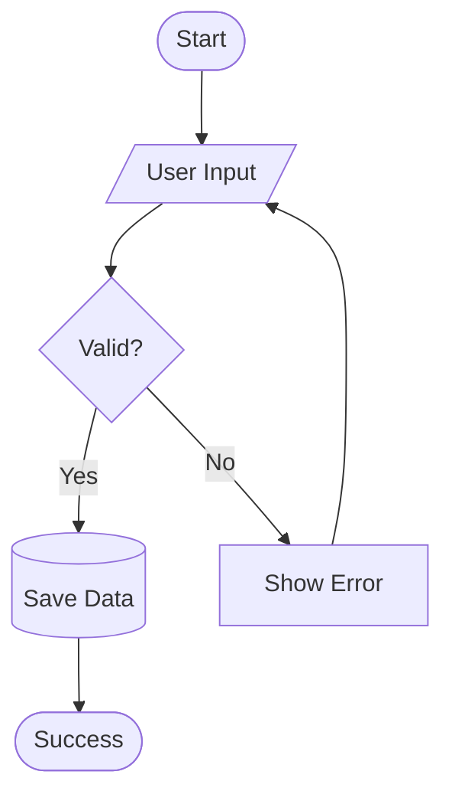
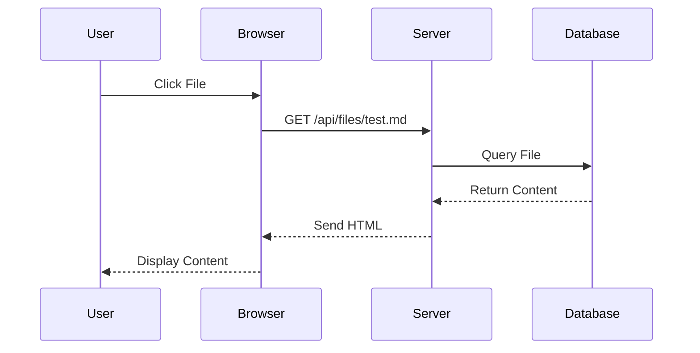
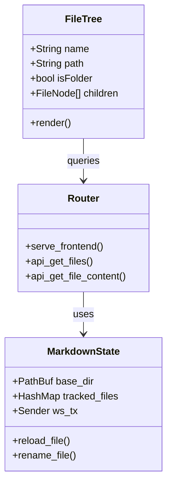
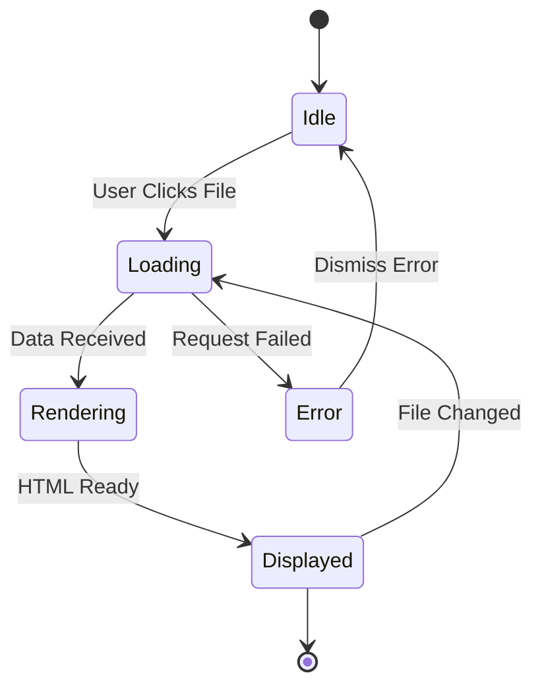
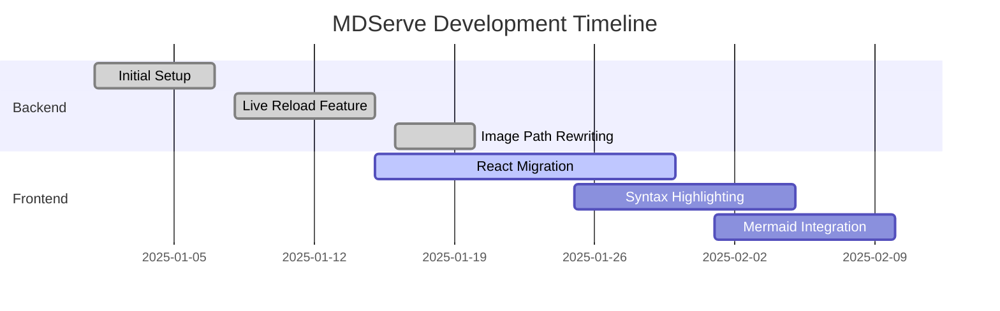
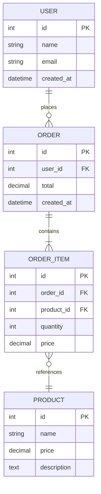
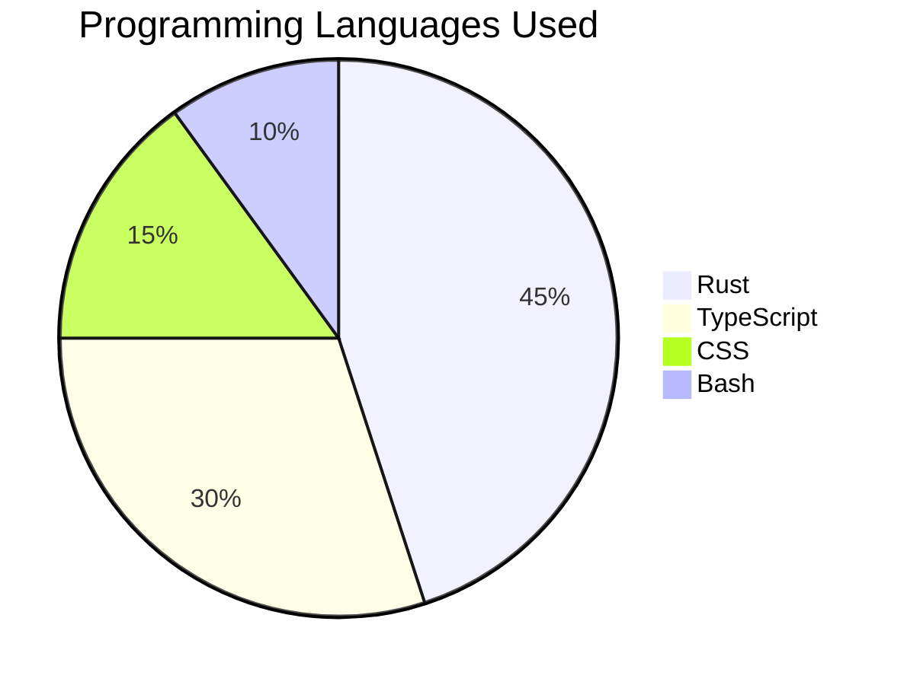
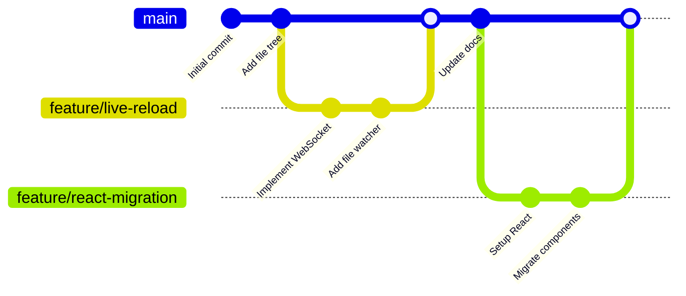

# Mermaid Diagrams Test

This document tests various Mermaid diagram types.

## Flowchart

## Sequence Diagram

## Class Diagram

## State Diagram

## Gantt Chart

## Entity Relationship Diagram

## Pie Chart

## Git Graph

